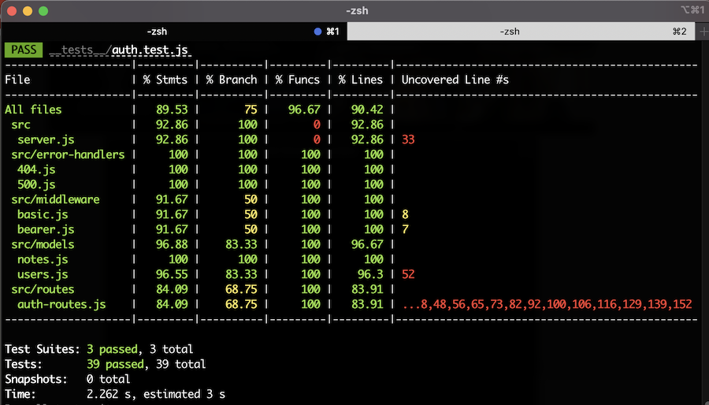
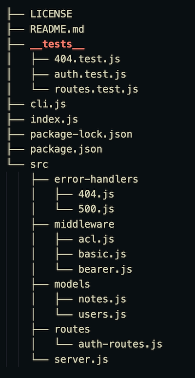
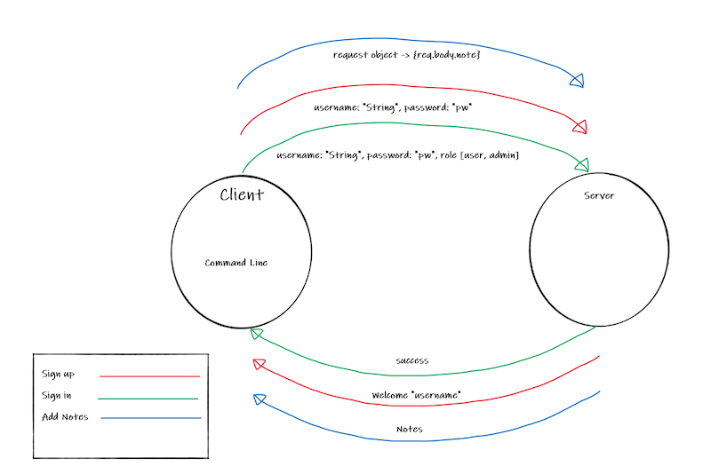

# **auth-api-CLI**

Authors: Peter Staker, Ted Knecht, Nicki Baldwin, Jessi Velazquez

Deployed Link: [https://auth-api-cli.herokuapp.com/](https://auth-api-cli.herokuapp.com/)

Pull Request: [https://github.com/A-TEAM-401/auth-api-CLI/pull/2](https://github.com/A-TEAM-401/auth-api-CLI/pull/2)

Testing (GitHub Actions): [https://github.com/A-TEAM-401/auth-api-CLI/actions](https://github.com/A-TEAM-401/auth-api-CLI/actions)

## Overview and Description

This is a command line interface (CLI) application built in Node.js and uses Basic and Bearer authorization to sign up and sign in users, then presents the user with a prompt to create, update, or delete a note. The notes are saved to the user's account, and the full list of notes is displayed back to the user when the user selects options to either update or delete a note. The application uses the Node package dependencies Chalk Animation and Figlet to create beautiful rainbow colored ASCII art in the terminal.

## **Setup**

Clone the repository from the following link, and then follow the instructions in the sections below: [https://github.com/A-TEAM-401/auth-api-CLI](https://github.com/A-TEAM-401/auth-api-CLI)

## .env Requirements

To run the application, you must create a .env file at the root level, with the following environmental variables included:

```
PORT=3333
MONGODB_URI=mongodb+srv://dbUser:<password>@cluster0.oodoc.mongodb.net/myFirstDatabase?retryWrites=true&w=majority
SECRET=coolsecret
SERVER=http://localhost:3333
```

## Dependencies

Before attempting to run the application locally, it is vital to install the required dependencies. Do so by running the following command in the terminal from the root level:

```
npm i
```

## Run the Application

To run the application, run the following command in the terminal at the root level:

```
npm start
```

## Tests - npm run test

To run tests on the code, run the following command in the terminal at the root level:

```
npm run test
```

**Test Coverage Report**




## Architecture



## UML

